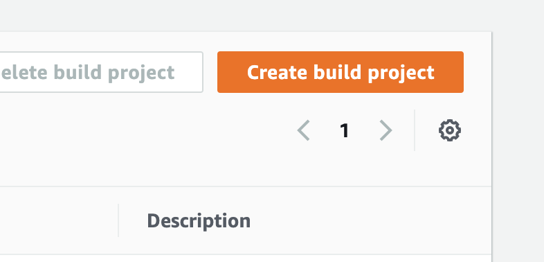

# Setting up a Serverless CI/CD on AWS for Laravel

Automate the deployment of your Laravel app from a Github push all the way to the serverless cloud!

## Table of Contents

1. [Getting Laravel on AWS Lambda](#part1)
2. [Building/Deploying with AWS Codebuild](#part2)

<div id='part1'/>

## Getting Laravel on AWS Lambda

We will use [Bref](https://bref.sh/) with the composer package [laravel-bridge](https://github.com/brefphp/laravel-bridge) as suggested in Bref's [docs](https://bref.sh/docs/frameworks/laravel.html).

### Installation

Visit the root directory of your laravel app and run the following:

`composer require bref/bref bref/laravel-bridge`

Then run the following command to generate a `serverless.yml` file. The laravel-bridge package will preconfigure it for us to deploy our app easily!

`php artisan vendor:publish --tag=serverless-config`

*Note: laravel-bridge might have some compatibility issues with older versions of laravel regarding illuminate/support and illuminate/queue. I used laravel 7, though a [pull request](https://github.com/brefphp/laravel-bridge/pull/13) was recently merged to support laravel 8. Additionally using version ^3.0 of laravel/ui for react also does not work. I used laravel/ui:^2.4*

### Deployment

Clear caches then deploy!

`php artisan config:clear`

`serverless deploy`

The end result should look something like this:

```
Serverless: Packaging service...
Serverless: Excluding development dependencies...
Serverless: Uploading CloudFormation file to S3...
Serverless: Uploading artifacts...
Serverless: Uploading service laravel.zip file to S3 (16.04 MB)...
Serverless: Validating template...
Serverless: Updating Stack...
Serverless: Checking Stack update progress...
....................
Serverless: Stack update finished...
Service Information
service: laravel
stage: dev
region: us-east-1
stack: laravel-dev
resources: 15
api keys:
  None
endpoints:
  ANY - https://nqh0z4t3v2.execute-api.us-east-1.amazonaws.com/dev
  ANY - https://nqh0z4t3v2.execute-api.us-east-1.amazonaws.com/dev/{proxy+}
functions:
  web: laravel-dev-web
  artisan: laravel-dev-artisan
layers:
  None
Serverless: Removing old service artifacts from S3...
```

More information regarding this process is detailed [here](https://bref.sh/docs/frameworks/laravel.html).

<div id='part2'/>

## Building/Deploying with AWS Codebuild

Login to [AWS Codebuild](https://aws.amazon.com/codebuild/) and visit the console. To get started, click "Create Build Project".



You will see the following fields:

- **Project Configuration**: Enter a project name/description
- **Source**: Link the github repo here. Multiple sources may be added.
- **Environment**:
    - *Operating system*: I used Amazon Linux 2
    - *Service Role*: You will want to use the same role across all builds. If you have not created one yet you can auto-generate one here. The role will need all of the proper permissions to perform the build. More on that later.
    - *Additional Configuration*: Add VPC, EFS, and env variables here
- **Buildspec**: Use a buildspec file. Since we will use multiple buildspec files I suggest giving it a unique name and supplying that name here.
- **Artifacts**: 
- **Logs**: Optional if you want to use Cloudwatch


